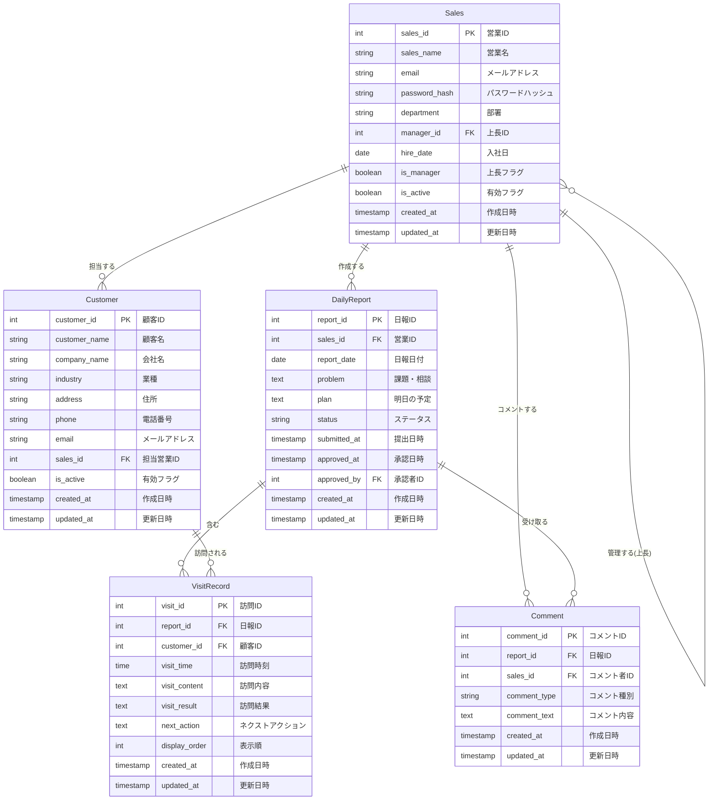
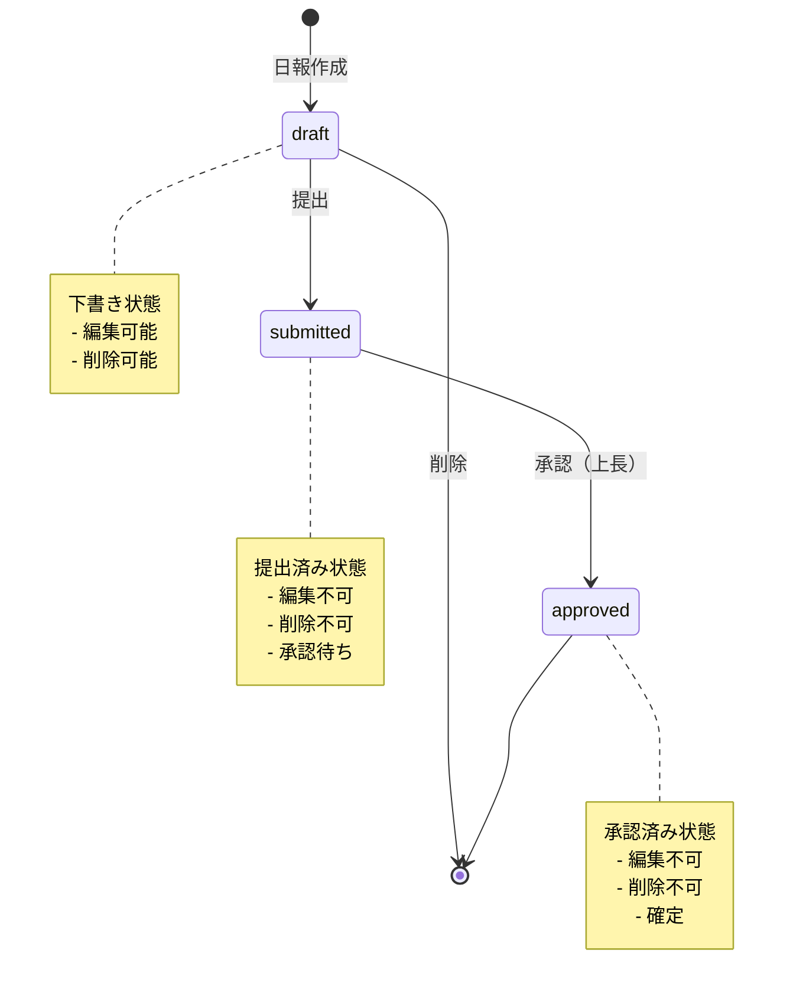
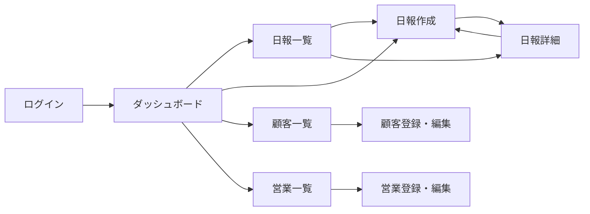

# 営業日報システム 要件定義書

## プロジェクト概要

営業担当者が日々の顧客訪問活動を報告し、課題や計画を共有するシステム。上長は報告内容を確認し、適切なアドバイスをコメントとして提供できる。

---

## 目次

1. [システム概要](#システム概要)
2. [主要機能](#主要機能)
3. [ユーザーロール](#ユーザーロール)
4. [機能要件](#機能要件)
5. [ER図](#er図)
6. [エンティティ詳細](#エンティティ詳細)
7. [非機能要件](#非機能要件)
8. [使用技術](#使用技術)

---

## システム概要

### システム名

営業日報システム (Sales Daily Report System)

### 目的

- 営業担当者の日々の活動を可視化
- 上長が部下の活動状況を把握し、適切な指導を行う
- 顧客訪問履歴の蓄積と分析

### 対象ユーザー

- 営業担当者：日報を作成・提出
- 上長（マネージャー）：部下の日報を確認・承認・コメント
- システム管理者：マスタデータの管理

---

## 主要機能

### 1. 日報管理機能

営業担当者が日次で活動報告を行う

**主な機能：**

- 日報の作成・編集・削除
- 下書き保存機能
- 日報の提出（ステータス変更）
- 日報の一覧表示・検索
- 日報の詳細表示

**記録内容：**

- 訪問記録（複数件登録可能）
- Problem（今日の課題・相談事項）
- Plan（明日の予定・やること）

### 2. 訪問記録機能

1日報に複数の顧客訪問記録を登録

**記録内容：**

- 訪問顧客（顧客マスタから選択）
- 訪問時刻
- 訪問内容・商談内容
- 訪問結果
- ネクストアクション

### 3. コメント機能

上長が日報のProblem・Planに対してコメント

**主な機能：**

- コメントの投稿（上長のみ）
- コメントの削除（上長のみ）
- コメント種別の指定（Problem/Plan）
- 複数コメントの投稿（対話形式）

### 4. 承認機能

上長が部下の日報を承認

**承認フロー：**

1. 営業担当者が日報を提出（draft → submitted）
2. 上長が内容を確認し、必要に応じてコメント
3. 上長が承認（submitted → approved）

### 5. マスタ管理機能

#### 顧客マスタ

- 顧客情報の登録・編集・削除
- 顧客の検索・絞り込み
- 担当営業の割り当て

#### 営業マスタ

- 営業担当者情報の登録・編集・削除（上長のみ）
- 上長の設定（組織階層）
- 権限の設定（営業/上長）

---

## ユーザーロール

### 営業担当者（Sales）

**権限：**

- 自分の日報の作成・編集・削除・提出
- 自分の日報の閲覧
- 自分が担当する顧客の閲覧・登録・編集
- 上長からのコメントの閲覧

**制限：**

- 他人の日報は閲覧不可
- 提出済み・承認済みの日報は編集不可
- コメントの投稿不可
- 営業マスタの閲覧・編集不可

### 上長（Manager）

**権限：**

- 配下の営業担当者の日報の閲覧
- 日報へのコメント投稿・削除
- 日報の承認
- すべての顧客情報の閲覧・編集
- 営業マスタの登録・編集・削除

**制限：**

- 他人の日報の編集不可（閲覧とコメントのみ）
- 他部署の日報は閲覧不可（配下のみ）

---

## 機能要件

### 1. 日報作成・編集機能

#### FR-001: 日報作成

- 営業担当者は日次で日報を作成できる
- 1日につき1件の日報のみ作成可能（重複不可）
- 作成時のデフォルトステータスは「下書き」

#### FR-002: 日報編集

- 下書き状態の日報のみ編集可能
- 提出済み・承認済みの日報は編集不可
- 自分の日報のみ編集可能

#### FR-003: 日報削除

- 下書き状態の日報のみ削除可能
- 提出済み・承認済みの日報は削除不可

#### FR-004: 下書き保存

- 入力途中の日報を下書きとして保存可能
- 下書き状態では何度でも編集可能

#### FR-005: 日報提出

- 必須項目がすべて入力されている場合のみ提出可能
- 訪問記録が1件以上登録されていることが必須
- 提出後はステータスが「提出済み」に変更
- 提出日時が記録される

### 2. 訪問記録機能

#### FR-011: 訪問記録追加

- 1日報に複数の訪問記録を登録可能（最大10件を推奨）
- 顧客は顧客マスタから選択
- 訪問時刻、訪問内容は必須入力

#### FR-012: 訪問記録編集

- 下書き状態の日報に紐づく訪問記録のみ編集可能

#### FR-013: 訪問記録削除

- 下書き状態の日報に紐づく訪問記録のみ削除可能
- 最低1件の訪問記録が必要（提出時）

#### FR-014: 訪問記録の表示順制御

- display_orderで表示順を制御
- 訪問時刻の昇順で表示することを推奨

### 3. コメント機能

#### FR-021: コメント投稿

- 上長のみが配下の営業の日報にコメント可能
- Problem・Planそれぞれに対してコメント可能
- コメント種別（problem/plan）を指定
- 複数のコメントを投稿可能（対話形式）

#### FR-022: コメント削除

- 上長のみが自分のコメントを削除可能

#### FR-023: コメント通知

- 営業担当者は上長からのコメントを受け取ると通知される（オプション）

### 4. 承認機能

#### FR-031: 日報承認

- 上長のみが配下の営業の日報を承認可能
- 提出済み状態の日報のみ承認可能
- 承認後はステータスが「承認済み」に変更
- 承認日時と承認者が記録される

#### FR-032: 承認取り消し

- 承認済みの日報は承認取り消し不可（要件外）
- 修正が必要な場合は新規日報を作成

### 5. 日報検索・表示機能

#### FR-041: 日報一覧表示

- 営業担当者：自分の日報のみ表示
- 上長：配下の営業の日報を表示
- デフォルトは作成日の降順でソート

#### FR-042: 日報検索

- 期間指定（開始日～終了日）
- ステータス絞り込み（下書き/提出済み/承認済み）
- 営業担当者絞り込み（上長のみ）

#### FR-043: 日報詳細表示

- 日報の基本情報
- すべての訪問記録
- Problem・Plan
- すべてのコメント（時系列順）

### 6. 顧客マスタ機能

#### FR-051: 顧客登録

- 営業担当者は自分が担当する顧客を登録可能
- 上長はすべての顧客を登録可能

#### FR-052: 顧客編集

- 営業担当者は自分が担当する顧客のみ編集可能
- 上長はすべての顧客を編集可能

#### FR-053: 顧客削除

- 論理削除（is_activeフラグで制御）
- 物理削除は行わない（履歴保持のため）

#### FR-054: 顧客検索

- 顧客名・会社名での部分一致検索
- 業種での絞り込み
- 担当営業での絞り込み（上長のみ）

### 7. 営業マスタ機能

#### FR-061: 営業担当者登録

- 上長のみが営業担当者を登録可能
- メールアドレスは一意（重複不可）
- パスワードは8文字以上

#### FR-062: 営業担当者編集

- 上長のみが配下の営業担当者を編集可能
- パスワード変更時は再入力が必要

#### FR-063: 営業担当者削除

- 論理削除（is_activeフラグで制御）
- 物理削除は行わない（履歴保持のため）

#### FR-064: 組織階層

- 各営業担当者は1人の上長を持つ
- 上長は複数の部下を持つことができる
- 上長フラグ（is_manager）で権限を判定

---

## ER図

---

## エンティティ詳細

### Sales（営業マスタ）

営業担当者と上長の情報を管理するテーブル。

| カラム名      | 型           | 制約                                          | 説明                         |
| ------------- | ------------ | --------------------------------------------- | ---------------------------- |
| sales_id      | INT          | PK, AUTO_INCREMENT                            | 営業ID（主キー）             |
| sales_name    | VARCHAR(50)  | NOT NULL                                      | 営業担当者名                 |
| email         | VARCHAR(100) | NOT NULL, UNIQUE                              | メールアドレス（ログインID） |
| password_hash | VARCHAR(255) | NOT NULL                                      | パスワードハッシュ（bcrypt） |
| department    | VARCHAR(50)  | NOT NULL                                      | 所属部署                     |
| manager_id    | INT          | FK, NULL                                      | 上長ID（自己参照）           |
| hire_date     | DATE         | NOT NULL                                      | 入社日                       |
| is_manager    | BOOLEAN      | NOT NULL, DEFAULT FALSE                       | 上長権限フラグ               |
| is_active     | BOOLEAN      | NOT NULL, DEFAULT TRUE                        | 有効フラグ（論理削除用）     |
| created_at    | TIMESTAMP    | NOT NULL, DEFAULT CURRENT_TIMESTAMP           | 作成日時                     |
| updated_at    | TIMESTAMP    | NOT NULL, DEFAULT CURRENT_TIMESTAMP ON UPDATE | 更新日時                     |

**インデックス：**

- PRIMARY KEY (sales_id)
- UNIQUE INDEX (email)
- INDEX (manager_id)
- INDEX (is_active)

**外部キー：**

- manager_id → Sales(sales_id)

---

### Customer（顧客マスタ）

顧客情報を管理するテーブル。

| カラム名      | 型           | 制約                                          | 説明                     |
| ------------- | ------------ | --------------------------------------------- | ------------------------ |
| customer_id   | INT          | PK, AUTO_INCREMENT                            | 顧客ID（主キー）         |
| customer_name | VARCHAR(50)  | NOT NULL                                      | 顧客名                   |
| company_name  | VARCHAR(100) | NOT NULL                                      | 会社名                   |
| industry      | VARCHAR(50)  | NOT NULL                                      | 業種                     |
| address       | VARCHAR(200) | NULL                                          | 住所                     |
| phone         | VARCHAR(20)  | NULL                                          | 電話番号                 |
| email         | VARCHAR(100) | NULL                                          | メールアドレス           |
| sales_id      | INT          | FK, NOT NULL                                  | 担当営業ID               |
| is_active     | BOOLEAN      | NOT NULL, DEFAULT TRUE                        | 有効フラグ（論理削除用） |
| created_at    | TIMESTAMP    | NOT NULL, DEFAULT CURRENT_TIMESTAMP           | 作成日時                 |
| updated_at    | TIMESTAMP    | NOT NULL, DEFAULT CURRENT_TIMESTAMP ON UPDATE | 更新日時                 |

**インデックス：**

- PRIMARY KEY (customer_id)
- INDEX (sales_id)
- INDEX (company_name)
- INDEX (industry)
- INDEX (is_active)

**外部キー：**

- sales_id → Sales(sales_id)

---

### DailyReport（日報）

営業担当者の日次報告を管理するテーブル。

| カラム名     | 型         | 制約                                          | 説明                                   |
| ------------ | ---------- | --------------------------------------------- | -------------------------------------- |
| report_id    | INT        | PK, AUTO_INCREMENT                            | 日報ID（主キー）                       |
| sales_id     | INT        | FK, NOT NULL                                  | 営業ID                                 |
| report_date  | DATE       | NOT NULL                                      | 日報日付                               |
| problem      | TEXT(1000) | NULL                                          | 課題・相談事項                         |
| plan         | TEXT(1000) | NULL                                          | 明日の予定                             |
| status       | ENUM       | NOT NULL, DEFAULT 'draft'                     | ステータス（draft/submitted/approved） |
| submitted_at | TIMESTAMP  | NULL                                          | 提出日時                               |
| approved_at  | TIMESTAMP  | NULL                                          | 承認日時                               |
| approved_by  | INT        | FK, NULL                                      | 承認者ID                               |
| created_at   | TIMESTAMP  | NOT NULL, DEFAULT CURRENT_TIMESTAMP           | 作成日時                               |
| updated_at   | TIMESTAMP  | NOT NULL, DEFAULT CURRENT_TIMESTAMP ON UPDATE | 更新日時                               |

**インデックス：**

- PRIMARY KEY (report_id)
- UNIQUE INDEX (sales_id, report_date)
- INDEX (status)
- INDEX (report_date)

**外部キー：**

- sales_id → Sales(sales_id)
- approved_by → Sales(sales_id)

**制約：**

- UNIQUE (sales_id, report_date)：1営業担当者につき1日1件のみ

---

### VisitRecord（訪問記録）

顧客訪問の詳細を管理するテーブル。

| カラム名      | 型        | 制約                                          | 説明               |
| ------------- | --------- | --------------------------------------------- | ------------------ |
| visit_id      | INT       | PK, AUTO_INCREMENT                            | 訪問ID（主キー）   |
| report_id     | INT       | FK, NOT NULL                                  | 日報ID             |
| customer_id   | INT       | FK, NOT NULL                                  | 顧客ID             |
| visit_time    | TIME      | NOT NULL                                      | 訪問時刻           |
| visit_content | TEXT(500) | NOT NULL                                      | 訪問内容           |
| visit_result  | TEXT(500) | NULL                                          | 訪問結果           |
| next_action   | TEXT(200) | NULL                                          | ネクストアクション |
| display_order | INT       | NOT NULL, DEFAULT 0                           | 表示順             |
| created_at    | TIMESTAMP | NOT NULL, DEFAULT CURRENT_TIMESTAMP           | 作成日時           |
| updated_at    | TIMESTAMP | NOT NULL, DEFAULT CURRENT_TIMESTAMP ON UPDATE | 更新日時           |

**インデックス：**

- PRIMARY KEY (visit_id)
- INDEX (report_id, display_order)
- INDEX (customer_id)

**外部キー：**

- report_id → DailyReport(report_id) ON DELETE CASCADE
- customer_id → Customer(customer_id)

---

### Comment（コメント）

上長からの日報へのコメントを管理するテーブル。

| カラム名     | 型        | 制約                                          | 説明                         |
| ------------ | --------- | --------------------------------------------- | ---------------------------- |
| comment_id   | INT       | PK, AUTO_INCREMENT                            | コメントID（主キー）         |
| report_id    | INT       | FK, NOT NULL                                  | 日報ID                       |
| sales_id     | INT       | FK, NOT NULL                                  | コメント者ID（上長）         |
| comment_type | ENUM      | NOT NULL                                      | コメント種別（problem/plan） |
| comment_text | TEXT(500) | NOT NULL                                      | コメント内容                 |
| created_at   | TIMESTAMP | NOT NULL, DEFAULT CURRENT_TIMESTAMP           | 作成日時                     |
| updated_at   | TIMESTAMP | NOT NULL, DEFAULT CURRENT_TIMESTAMP ON UPDATE | 更新日時                     |

**インデックス：**

- PRIMARY KEY (comment_id)
- INDEX (report_id, comment_type)
- INDEX (created_at)

**外部キー：**

- report_id → DailyReport(report_id) ON DELETE CASCADE
- sales_id → Sales(sales_id)

---

## 使用技術

**言語:** TypeScript
**フレームワーク** Next.js(App Router)
**UIコンポーネント** shadcn/ui + Tailwind CSS
**APIスキーマ定義** OpenAPI(Zodによる検証)
**DBスキーマ定義** Prisma.js
**テスト** Vitest
**デプロイ** Google Cloud Run

---

## 非機能要件

### パフォーマンス要件

#### NFR-001: レスポンスタイム

- 一覧取得API: 500ms以内
- 詳細取得API: 300ms以内
- 作成・更新API: 1000ms以内

#### NFR-002: 同時アクセス

- 100ユーザーの同時アクセスに対応
- エラー率5%以下を維持

#### NFR-003: データ量

- 1万件の日報データでもパフォーマンスが劣化しない

### セキュリティ要件

#### NFR-011: 認証・認可

- JWT（JSON Web Token）による認証
- アクセストークン有効期限: 1時間
- リフレッシュトークン有効期限: 30日

#### NFR-012: パスワード管理

- bcryptによるハッシュ化
- パスワード強度: 8文字以上

#### NFR-013: 通信の暗号化

- 本番環境はHTTPS必須
- TLS 1.2以上

#### NFR-014: SQLインジェクション対策

- プリペアドステートメント使用
- ORMの使用を推奨

#### NFR-015: XSS対策

- 入力値のサニタイジング
- 出力時のエスケープ処理

### 可用性要件

#### NFR-021: 稼働率

- 稼働率99%以上（月間ダウンタイム7.2時間以内）

#### NFR-022: バックアップ

- データベースの日次バックアップ
- バックアップデータの保管期間: 30日

### 保守性要件

#### NFR-031: ログ

- すべてのAPIリクエストをログに記録
- エラー発生時はスタックトレースを記録
- ログ保管期間: 90日

#### NFR-032: モニタリング

- サーバーのリソース使用率を監視
- エラー率の監視
- レスポンスタイムの監視

### 互換性要件

#### NFR-041: ブラウザ対応

- Chrome（最新版）
- Firefox（最新版）
- Safari（最新版）
- Edge（最新版）

#### NFR-042: デバイス対応

- PC（Windows, Mac）
- タブレット（iPad）
- スマートフォン（iPhone, Android）

### 拡張性要件

#### NFR-051: スケーラビリティ

- 水平スケーリング可能な設計
- ステートレスなアーキテクチャ

#### NFR-052: APIバージョニング

- URLパスにバージョン番号を含める
- 後方互換性のない変更時は新バージョンをリリース

---

## ステータス遷移図

### 日報のステータス遷移

---

## 画面遷移図

---

## 用語集

| 用語       | 説明                                             |
| ---------- | ------------------------------------------------ |
| 日報       | 営業担当者が日次で作成する活動報告書             |
| 訪問記録   | 顧客訪問の詳細情報（1日報に複数登録可能）        |
| Problem    | 今日の課題や相談事項                             |
| Plan       | 明日の予定ややること                             |
| 上長       | マネージャー・部長など、部下を持つ営業担当者     |
| 承認       | 上長が部下の日報を確認し、承認すること           |
| 論理削除   | データを物理的に削除せず、フラグで無効化すること |
| ステータス | 日報の状態（draft/submitted/approved）           |

---

## 参考資料

### 画面定義書

@doc/screen-definitions.md

### API仕様書

@doc/api-specifications.md

### テスト仕様書

@doc/test-specifications.md

---

## 変更履歴

| 日付       | バージョン | 変更内容 | 担当者 |
| ---------- | ---------- | -------- | ------ |
| 2026-01-05 | 1.0.0      | 初版作成 | Claude |

---

## 承認

| 役割                 | 氏名 | 承認日 | 署名 |
| -------------------- | ---- | ------ | ---- |
| プロジェクトオーナー |      |        |      |
| システムアーキテクト |      |        |      |
| 開発リーダー         |      |        |      |
