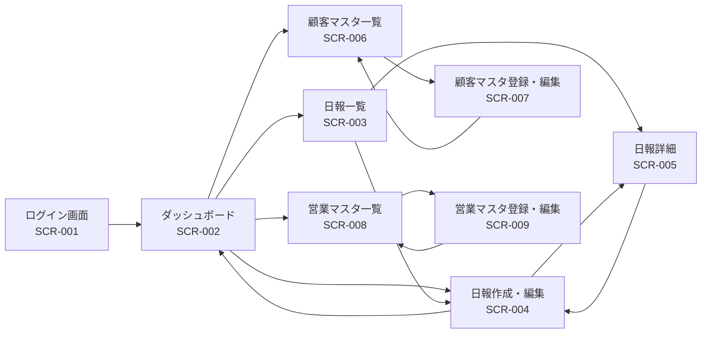

# 営業日報システム 画面定義書

## 目次

1. [ログイン画面](#1-ログイン画面)
2. [ダッシュボード](#2-ダッシュボード)
3. [日報一覧画面](#3-日報一覧画面)
4. [日報作成・編集画面](#4-日報作成編集画面)
5. [日報詳細画面](#5-日報詳細画面)
6. [顧客マスタ一覧画面](#6-顧客マスタ一覧画面)
7. [顧客マスタ登録・編集画面](#7-顧客マスタ登録編集画面)
8. [営業マスタ一覧画面](#8-営業マスタ一覧画面)
9. [営業マスタ登録・編集画面](#9-営業マスタ登録編集画面)

---

## 1. ログイン画面

### 画面ID

`SCR-001`

### 画面名

ログイン画面

### 概要

営業担当者および上長がシステムにログインするための画面

### アクセス権限

- 全ユーザー（未認証）

### 画面レイアウト

```
+----------------------------------+
|   営業日報システム                |
+----------------------------------+
|                                  |
|  メールアドレス: [____________]   |
|  パスワード:     [____________]   |
|                                  |
|         [ログイン]               |
|                                  |
+----------------------------------+
```

### 入力項目

| 項目名         | 形式       | 必須 | 説明                       |
| -------------- | ---------- | ---- | -------------------------- |
| メールアドレス | テキスト   | ○    | 営業担当者のメールアドレス |
| パスワード     | パスワード | ○    | ログインパスワード         |

### ボタン/アクション

| ボタン名 | 処理内容                                       |
| -------- | ---------------------------------------------- |
| ログイン | 認証処理を実行し、成功時はダッシュボードへ遷移 |

### バリデーション

- メールアドレス形式チェック
- パスワード：8文字以上
- 認証失敗時はエラーメッセージ表示

### 画面遷移

- ログイン成功 → ダッシュボード（SCR-002）

---

## 2. ダッシュボード

### 画面ID

`SCR-002`

### 画面名

ダッシュボード（ホーム画面）

### 概要

ログイン後の初期画面。日報の提出状況や重要な通知を表示

### アクセス権限

- 営業担当者：自分の情報のみ表示
- 上長：配下の営業担当者の情報を表示

### 画面レイアウト

```
+--------------------------------------------------+
| [ロゴ] 営業日報システム     [営業名] [ログアウト] |
+--------------------------------------------------+
| [ダッシュボード] [日報一覧] [顧客] [営業] [設定]   |
+--------------------------------------------------+
|                                                  |
| ■ 今日の日報                                     |
|   [今日の日報を作成する]                          |
|   または                                         |
|   今日の日報: 【下書き】 [編集する]               |
|                                                  |
| ■ 直近の日報一覧                                 |
|   +--------------------------------------------+ |
|   | 日付       | ステータス | アクション        | |
|   +--------------------------------------------+ |
|   | 2026-01-04 | 提出済み   | [詳細]           | |
|   | 2026-01-03 | 承認済み   | [詳細]           | |
|   | 2026-01-02 | 提出済み   | [詳細]           | |
|   +--------------------------------------------+ |
|                                                  |
| ■ 通知                                           |
|   - 上長からのコメントがあります (2件)            |
|                                                  |
| [すべての日報を見る]                              |
|                                                  |
+--------------------------------------------------+
```

### 表示項目

| 項目名               | 説明                                       |
| -------------------- | ------------------------------------------ |
| 今日の日報ステータス | 本日の日報が未作成/下書き/提出済みかを表示 |
| 直近の日報一覧       | 過去5件の日報を表示                        |
| 通知                 | 上長からのコメント等の未読通知             |

### ボタン/アクション

| ボタン名             | 処理内容                     |
| -------------------- | ---------------------------- |
| 今日の日報を作成する | 日報作成画面へ遷移           |
| 編集する             | 下書き中の日報編集画面へ遷移 |
| 詳細                 | 該当日報の詳細画面へ遷移     |
| すべての日報を見る   | 日報一覧画面へ遷移           |

### 画面遷移

- 今日の日報を作成する → 日報作成画面（SCR-004）
- 編集する → 日報編集画面（SCR-004）
- 詳細 → 日報詳細画面（SCR-005）
- すべての日報を見る → 日報一覧画面（SCR-003）

---

## 3. 日報一覧画面

### 画面ID

`SCR-003`

### 画面名

日報一覧画面

### 概要

作成した日報の一覧を表示し、検索・絞り込みが可能

### アクセス権限

- 営業担当者：自分の日報のみ表示
- 上長：配下の営業担当者の日報も表示可能

### 画面レイアウト

```
+--------------------------------------------------+
| [ロゴ] 営業日報システム     [営業名] [ログアウト] |
+--------------------------------------------------+
| [ダッシュボード] [日報一覧] [顧客] [営業] [設定]   |
+--------------------------------------------------+
|                                                  |
| ■ 日報一覧                        [新規作成]     |
|                                                  |
| 検索条件:                                        |
| 期間: [2026-01-01] ～ [2026-01-31]              |
| ステータス: [すべて ▼]                           |
| 営業担当: [すべて ▼] ※上長のみ表示               |
|                                   [検索]  [クリア]|
|                                                  |
| +----------------------------------------------+ |
| | 日付  | 営業名 | 訪問件数 | ステータス | 操作 | |
| +----------------------------------------------+ |
| | 01/04 | 山田   | 3件     | 提出済み   | [詳細]| |
| | 01/03 | 山田   | 2件     | 承認済み   | [詳細]| |
| | 01/02 | 山田   | 4件     | 提出済み   | [詳細]| |
| | ...                                          | |
| +----------------------------------------------+ |
|                                                  |
| < 前へ  1 2 3 4 5  次へ >                        |
|                                                  |
+--------------------------------------------------+
```

### 表示項目

| 項目名     | 説明                             |
| ---------- | -------------------------------- |
| 日付       | 日報の日付                       |
| 営業名     | 日報作成者（上長の場合のみ表示） |
| 訪問件数   | その日の顧客訪問件数             |
| ステータス | 下書き/提出済み/承認済み         |

### 検索条件

| 項目名       | 形式       | 説明                               |
| ------------ | ---------- | ---------------------------------- |
| 期間（開始） | 日付       | 検索開始日                         |
| 期間（終了） | 日付       | 検索終了日                         |
| ステータス   | プルダウン | すべて/下書き/提出済み/承認済み    |
| 営業担当     | プルダウン | 上長のみ表示。配下の営業で絞り込み |

### ボタン/アクション

| ボタン名 | 処理内容                 |
| -------- | ------------------------ |
| 新規作成 | 日報作成画面へ遷移       |
| 検索     | 検索条件で日報を絞り込み |
| クリア   | 検索条件をクリア         |
| 詳細     | 該当日報の詳細画面へ遷移 |

### 画面遷移

- 新規作成 → 日報作成画面（SCR-004）
- 詳細 → 日報詳細画面（SCR-005）

---

## 4. 日報作成・編集画面

### 画面ID

`SCR-004`

### 画面名

日報作成・編集画面

### 概要

日報を新規作成または編集する画面

### アクセス権限

- 営業担当者：自分の日報のみ作成・編集可能
- 上長：閲覧のみ（編集不可）

### 画面レイアウト

```
+--------------------------------------------------+
| [ロゴ] 営業日報システム     [営業名] [ログアウト] |
+--------------------------------------------------+
| [ダッシュボード] [日報一覧] [顧客] [営業] [設定]   |
+--------------------------------------------------+
|                                                  |
| ■ 日報作成                                       |
|                                                  |
| 日付: 2026-01-05 (土)                            |
| 営業担当: 山田太郎                                |
|                                                  |
| ━━━━━━━━━━━━━━━━━━━━━━━━━━━━━━━━             |
| ■ 訪問記録                                       |
| ━━━━━━━━━━━━━━━━━━━━━━━━━━━━━━━━             |
|                                                  |
| 訪問1                                 [削除]     |
| +--------------------------+                     |
| | 顧客名: [株式会社ABC ▼]  |                     |
| | 訪問時刻: [14:00]        |                     |
| | 訪問内容:                |                     |
| | [___________________]    |                     |
| | [___________________]    |                     |
| |                          |                     |
| | 訪問結果:                |                     |
| | [___________________]    |                     |
| |                          |                     |
| | ネクストアクション:       |                     |
| | [___________________]    |                     |
| +--------------------------+                     |
|                                                  |
| [+ 訪問記録を追加]                                |
|                                                  |
| ━━━━━━━━━━━━━━━━━━━━━━━━━━━━━━━━             |
| ■ Problem (今日の課題・相談)                     |
| ━━━━━━━━━━━━━━━━━━━━━━━━━━━━━━━━             |
| [_________________________________________]      |
| [_________________________________________]      |
| [_________________________________________]      |
|                                                  |
| ━━━━━━━━━━━━━━━━━━━━━━━━━━━━━━━━             |
| ■ Plan (明日の予定)                              |
| ━━━━━━━━━━━━━━━━━━━━━━━━━━━━━━━━             |
| [_________________________________________]      |
| [_________________________________________]      |
| [_________________________________________]      |
|                                                  |
|                                                  |
| [下書き保存]  [提出する]  [キャンセル]           |
|                                                  |
+--------------------------------------------------+
```

### 入力項目

#### 基本情報

| 項目名   | 形式             | 必須 | 説明                         |
| -------- | ---------------- | ---- | ---------------------------- |
| 日付     | 日付（自動）     | ○    | 日報の日付（自動設定）       |
| 営業担当 | テキスト（自動） | ○    | ログインユーザー（自動設定） |

#### 訪問記録（複数登録可能）

| 項目名             | 形式           | 必須 | 説明                                      |
| ------------------ | -------------- | ---- | ----------------------------------------- |
| 顧客名             | プルダウン     | ○    | 顧客マスタから選択                        |
| 訪問時刻           | 時刻           | ○    | HH:MM形式                                 |
| 訪問内容           | テキストエリア | ○    | 商談内容、提案内容など（500文字以内）     |
| 訪問結果           | テキストエリア | -    | 商談の結果、顧客の反応など（500文字以内） |
| ネクストアクション | テキストエリア | -    | 次回のアクション（200文字以内）           |

#### Problem/Plan

| 項目名  | 形式           | 必須 | 説明                                 |
| ------- | -------------- | ---- | ------------------------------------ |
| Problem | テキストエリア | -    | 今日の課題や相談事項（1000文字以内） |
| Plan    | テキストエリア | -    | 明日の予定（1000文字以内）           |

### ボタン/アクション

| ボタン名       | 処理内容                                             |
| -------------- | ---------------------------------------------------- |
| 訪問記録を追加 | 訪問記録の入力欄を追加（最大10件）                   |
| 削除           | 該当の訪問記録を削除                                 |
| 下書き保存     | ステータスを「下書き」として保存                     |
| 提出する       | バリデーション後、ステータスを「提出済み」として保存 |
| キャンセル     | 確認ダイアログ表示後、前の画面に戻る                 |

### バリデーション

- 訪問記録：最低1件以上必須
- 顧客名、訪問時刻、訪問内容は必須
- 各テキストエリアの文字数制限チェック
- 提出時は必須項目すべて入力済みであること

### 画面遷移

- 下書き保存/提出 → ダッシュボード（SCR-002）
- キャンセル → 前の画面

---

## 5. 日報詳細画面

### 画面ID

`SCR-005`

### 画面名

日報詳細画面

### 概要

提出済み・承認済みの日報を閲覧し、上長がコメントを追加できる画面

### アクセス権限

- 営業担当者：自分の日報を閲覧、上長のコメントを確認
- 上長：配下の営業の日報を閲覧、コメント追加可能

### 画面レイアウト

```
+--------------------------------------------------+
| [ロゴ] 営業日報システム     [営業名] [ログアウト] |
+--------------------------------------------------+
| [ダッシュボード] [日報一覧] [顧客] [営業] [設定]   |
+--------------------------------------------------+
|                                                  |
| ■ 日報詳細                                       |
|                                                  |
| 日付: 2026-01-04 (金)                            |
| 営業担当: 山田太郎                                |
| ステータス: [提出済み]                            |
| 提出日時: 2026-01-04 18:30                       |
|                                                  |
| [編集] [削除] ※下書きの場合のみ表示               |
|                                                  |
| ━━━━━━━━━━━━━━━━━━━━━━━━━━━━━━━━             |
| ■ 訪問記録 (3件)                                 |
| ━━━━━━━━━━━━━━━━━━━━━━━━━━━━━━━━             |
|                                                  |
| 訪問1                                            |
| +--------------------------+                     |
| | 顧客名: 株式会社ABC      |                     |
| | 訪問時刻: 10:00          |                     |
| | 訪問内容:                |                     |
| | 新製品の提案を実施...    |                     |
| |                          |                     |
| | 訪問結果:                |                     |
| | 好感触。見積依頼あり     |                     |
| |                          |                     |
| | ネクストアクション:       |                     |
| | 1週間以内に見積提出      |                     |
| +--------------------------+                     |
|                                                  |
| 訪問2 ... (同様に表示)                            |
|                                                  |
| ━━━━━━━━━━━━━━━━━━━━━━━━━━━━━━━━             |
| ■ Problem (今日の課題・相談)                     |
| ━━━━━━━━━━━━━━━━━━━━━━━━━━━━━━━━             |
| B社の価格交渉が難航しています。                   |
| 競合他社の見積が当社より20%安い状況です。         |
|                                                  |
| 【コメント】※上長のみ入力可能                     |
| +--------------------------------------------+   |
| | 佐藤部長 (2026-01-04 19:00)                |   |
| | 価格だけでなく、サポート体制の強みを       |   |
| | アピールしてみてください。                 |   |
| +--------------------------------------------+   |
|                                                  |
| [コメントを追加] ※上長のみ表示                    |
| [________________________]                       |
| [投稿]                                           |
|                                                  |
| ━━━━━━━━━━━━━━━━━━━━━━━━━━━━━━━━             |
| ■ Plan (明日の予定)                              |
| ━━━━━━━━━━━━━━━━━━━━━━━━━━━━━━━━             |
| - A社への見積提出                                |
| - C社との定例ミーティング                         |
| - B社価格交渉の上長相談                          |
|                                                  |
| 【コメント】※上長のみ入力可能                     |
| [コメントを追加] ※上長のみ表示                    |
| [________________________]                       |
| [投稿]                                           |
|                                                  |
|                                                  |
| [承認する] ※上長のみ、提出済みの場合表示          |
| [一覧に戻る]                                     |
|                                                  |
+--------------------------------------------------+
```

### 表示項目

| 項目名     | 説明                       |
| ---------- | -------------------------- |
| 日付       | 日報の日付                 |
| 営業担当   | 日報作成者                 |
| ステータス | 下書き/提出済み/承認済み   |
| 提出日時   | 日報が提出された日時       |
| 訪問記録   | すべての訪問記録を表示     |
| Problem    | 課題・相談内容             |
| Plan       | 明日の予定                 |
| コメント   | 上長からのコメント（複数） |

### 入力項目（上長のみ）

| 項目名   | 形式           | 必須 | 説明                                         |
| -------- | -------------- | ---- | -------------------------------------------- |
| コメント | テキストエリア | ○    | ProblemまたはPlanへのコメント（500文字以内） |

### ボタン/アクション

| ボタン名   | 処理内容                       | 表示条件                 |
| ---------- | ------------------------------ | ------------------------ |
| 編集       | 日報編集画面へ遷移             | 下書きの場合のみ         |
| 削除       | 確認後、日報を削除             | 下書きの場合のみ         |
| 投稿       | コメントを投稿                 | 上長のみ                 |
| 承認する   | ステータスを「承認済み」に変更 | 上長のみ、提出済みの場合 |
| 一覧に戻る | 日報一覧画面へ戻る             | 常時                     |

### バリデーション

- コメント投稿時：500文字以内

### 画面遷移

- 編集 → 日報編集画面（SCR-004）
- 一覧に戻る → 日報一覧画面（SCR-003）

---

## 6. 顧客マスタ一覧画面

### 画面ID

`SCR-006`

### 画面名

顧客マスタ一覧画面

### 概要

顧客情報の一覧を表示し、検索・絞り込み、新規登録、編集が可能

### アクセス権限

- 営業担当者：自分が担当する顧客のみ閲覧
- 上長：すべての顧客を閲覧・編集可能

### 画面レイアウト

```
+--------------------------------------------------+
| [ロゴ] 営業日報システム     [営業名] [ログアウト] |
+--------------------------------------------------+
| [ダッシュボード] [日報一覧] [顧客] [営業] [設定]   |
+--------------------------------------------------+
|                                                  |
| ■ 顧客マスタ一覧                  [新規登録]     |
|                                                  |
| 検索条件:                                        |
| 顧客名: [________]  会社名: [________]           |
| 業種: [すべて ▼]                                 |
| 担当営業: [すべて ▼] ※上長のみ表示               |
|                                   [検索]  [クリア]|
|                                                  |
| +----------------------------------------------+ |
| | 顧客名 | 会社名 | 業種 | 担当営業 | 操作    | |
| +----------------------------------------------+ |
| | 山田一郎| ABC社 | IT   | 山田     | [詳細]  | |
| | 佐藤花子| DEF社 | 製造 | 山田     | [詳細]  | |
| | 田中次郎| GHI社 | 小売 | 鈴木     | [詳細]  | |
| | ...                                          | |
| +----------------------------------------------+ |
|                                                  |
| < 前へ  1 2 3 4 5  次へ >                        |
|                                                  |
+--------------------------------------------------+
```

### 表示項目

| 項目名   | 説明             |
| -------- | ---------------- |
| 顧客名   | 顧客の氏名       |
| 会社名   | 顧客の会社名     |
| 業種     | 顧客の業種       |
| 担当営業 | 担当営業担当者名 |

### 検索条件

| 項目名   | 形式       | 説明                         |
| -------- | ---------- | ---------------------------- |
| 顧客名   | テキスト   | 部分一致検索                 |
| 会社名   | テキスト   | 部分一致検索                 |
| 業種     | プルダウン | IT/製造/小売/サービス/その他 |
| 担当営業 | プルダウン | 上長のみ表示                 |

### ボタン/アクション

| ボタン名 | 処理内容                 |
| -------- | ------------------------ |
| 新規登録 | 顧客登録画面へ遷移       |
| 検索     | 検索条件で顧客を絞り込み |
| クリア   | 検索条件をクリア         |
| 詳細     | 顧客詳細・編集画面へ遷移 |

### 画面遷移

- 新規登録 → 顧客マスタ登録画面（SCR-007）
- 詳細 → 顧客マスタ編集画面（SCR-007）

---

## 7. 顧客マスタ登録・編集画面

### 画面ID

`SCR-007`

### 画面名

顧客マスタ登録・編集画面

### 概要

顧客情報を新規登録または編集する画面

### アクセス権限

- 営業担当者：新規登録、自分が担当する顧客の編集のみ可能
- 上長：すべての顧客を登録・編集可能

### 画面レイアウト

```
+--------------------------------------------------+
| [ロゴ] 営業日報システム     [営業名] [ログアウト] |
+--------------------------------------------------+
| [ダッシュボード] [日報一覧] [顧客] [営業] [設定]   |
+--------------------------------------------------+
|                                                  |
| ■ 顧客登録                                       |
|                                                  |
| 顧客名 *:     [____________________]             |
| 会社名 *:     [____________________]             |
| 業種 *:       [IT ▼]                             |
| 住所:         [____________________]             |
| 電話番号:     [____________________]             |
| メールアドレス: [____________________]           |
| 担当営業 *:   [山田太郎 ▼]                       |
|                                                  |
| 有効フラグ:   [✓] 有効                           |
|                                                  |
|                                                  |
| [登録]  [キャンセル]                              |
|                                                  |
| ※編集時は [更新] [削除] [キャンセル]             |
|                                                  |
+--------------------------------------------------+
```

### 入力項目

| 項目名         | 形式             | 必須 | 説明                                |
| -------------- | ---------------- | ---- | ----------------------------------- |
| 顧客名         | テキスト         | ○    | 顧客の氏名（50文字以内）            |
| 会社名         | テキスト         | ○    | 会社名（100文字以内）               |
| 業種           | プルダウン       | ○    | IT/製造/小売/サービス/その他        |
| 住所           | テキスト         | -    | 住所（200文字以内）                 |
| 電話番号       | テキスト         | -    | 電話番号（ハイフンあり/なし両対応） |
| メールアドレス | テキスト         | -    | メールアドレス                      |
| 担当営業       | プルダウン       | ○    | 営業マスタから選択                  |
| 有効フラグ     | チェックボックス | ○    | 有効/無効                           |

### ボタン/アクション

| ボタン名   | 処理内容                         | 表示条件   |
| ---------- | -------------------------------- | ---------- |
| 登録       | バリデーション後、顧客情報を登録 | 新規登録時 |
| 更新       | バリデーション後、顧客情報を更新 | 編集時     |
| 削除       | 確認ダイアログ後、顧客情報を削除 | 編集時     |
| キャンセル | 前の画面に戻る                   | 常時       |

### バリデーション

- 必須項目チェック
- 電話番号：数字とハイフンのみ
- メールアドレス：形式チェック
- 文字数制限チェック

### 画面遷移

- 登録/更新 → 顧客マスタ一覧画面（SCR-006）
- キャンセル → 顧客マスタ一覧画面（SCR-006）

---

## 8. 営業マスタ一覧画面

### 画面ID

`SCR-008`

### 画面名

営業マスタ一覧画面

### 概要

営業担当者情報の一覧を表示（管理者・上長のみアクセス可能）

### アクセス権限

- 上長のみ：配下の営業担当者を閲覧・編集可能
- システム管理者：すべての営業担当者を閲覧・編集可能

### 画面レイアウト

```
+--------------------------------------------------+
| [ロゴ] 営業日報システム     [営業名] [ログアウト] |
+--------------------------------------------------+
| [ダッシュボード] [日報一覧] [顧客] [営業] [設定]   |
+--------------------------------------------------+
|                                                  |
| ■ 営業マスタ一覧                  [新規登録]     |
|                                                  |
| 検索条件:                                        |
| 営業名: [________]  部署: [すべて ▼]            |
| ステータス: [☑有効のみ]                          |
|                                   [検索]  [クリア]|
|                                                  |
| +----------------------------------------------+ |
| | 営業名 | 部署   | 上長   | 入社日 | 操作    | |
| +----------------------------------------------+ |
| | 山田太郎| 営業1部| 佐藤部長|2020/04 | [詳細] | |
| | 鈴木一郎| 営業1部| 佐藤部長|2021/04 | [詳細] | |
| | 田中花子| 営業2部| 高橋部長|2019/04 | [詳細] | |
| | ...                                          | |
| +----------------------------------------------+ |
|                                                  |
| < 前へ  1 2 3  次へ >                            |
|                                                  |
+--------------------------------------------------+
```

### 表示項目

| 項目名 | 説明             |
| ------ | ---------------- |
| 営業名 | 営業担当者の氏名 |
| 部署   | 所属部署         |
| 上長   | 上長の氏名       |
| 入社日 | 入社年月         |

### 検索条件

| 項目名     | 形式             | 説明                   |
| ---------- | ---------------- | ---------------------- |
| 営業名     | テキスト         | 部分一致検索           |
| 部署       | プルダウン       | 部署で絞り込み         |
| ステータス | チェックボックス | 有効なユーザーのみ表示 |

### ボタン/アクション

| ボタン名 | 処理内容                 |
| -------- | ------------------------ |
| 新規登録 | 営業登録画面へ遷移       |
| 検索     | 検索条件で営業を絞り込み |
| クリア   | 検索条件をクリア         |
| 詳細     | 営業詳細・編集画面へ遷移 |

### 画面遷移

- 新規登録 → 営業マスタ登録画面（SCR-009）
- 詳細 → 営業マスタ編集画面（SCR-009）

---

## 9. 営業マスタ登録・編集画面

### 画面ID

`SCR-009`

### 画面名

営業マスタ登録・編集画面

### 概要

営業担当者情報を新規登録または編集する画面

### アクセス権限

- 上長：配下の営業担当者のみ登録・編集可能
- システム管理者：すべての営業担当者を登録・編集可能

### 画面レイアウト

```
+--------------------------------------------------+
| [ロゴ] 営業日報システム     [営業名] [ログアウト] |
+--------------------------------------------------+
| [ダッシュボード] [日報一覧] [顧客] [営業] [設定]   |
+--------------------------------------------------+
|                                                  |
| ■ 営業担当者登録                                 |
|                                                  |
| 営業名 *:         [____________________]         |
| メールアドレス *: [____________________]         |
| パスワード *:     [____________________]         |
|   ※編集時は変更する場合のみ入力                  |
| 部署 *:           [営業1部 ▼]                   |
| 上長 *:           [佐藤部長 ▼]                   |
| 入社日 *:         [2020-04-01]                   |
|                                                  |
| 権限:             [☐ 上長権限]                   |
| 有効フラグ:       [✓] 有効                       |
|                                                  |
|                                                  |
| [登録]  [キャンセル]                              |
|                                                  |
| ※編集時は [更新] [削除] [キャンセル]             |
|                                                  |
+--------------------------------------------------+
```

### 入力項目

| 項目名         | 形式             | 必須 | 説明                                                      |
| -------------- | ---------------- | ---- | --------------------------------------------------------- |
| 営業名         | テキスト         | ○    | 営業担当者の氏名（50文字以内）                            |
| メールアドレス | テキスト         | ○    | ログイン用メールアドレス（重複不可）                      |
| パスワード     | パスワード       | ○    | ログインパスワード（8文字以上、編集時は変更する場合のみ） |
| 部署           | プルダウン       | ○    | 所属部署                                                  |
| 上長           | プルダウン       | ○    | 上長を営業マスタから選択                                  |
| 入社日         | 日付             | ○    | 入社年月日                                                |
| 権限           | チェックボックス | -    | 上長権限の有無                                            |
| 有効フラグ     | チェックボックス | ○    | 有効/無効                                                 |

### ボタン/アクション

| ボタン名   | 処理内容                                     | 表示条件   |
| ---------- | -------------------------------------------- | ---------- |
| 登録       | バリデーション後、営業情報を登録             | 新規登録時 |
| 更新       | バリデーション後、営業情報を更新             | 編集時     |
| 削除       | 確認ダイアログ後、営業情報を削除（論理削除） | 編集時     |
| キャンセル | 前の画面に戻る                               | 常時       |

### バリデーション

- 必須項目チェック
- メールアドレス：形式チェック、重複チェック
- パスワード：8文字以上、英数字混在推奨
- 文字数制限チェック

### 画面遷移

- 登録/更新 → 営業マスタ一覧画面（SCR-008）
- キャンセル → 営業マスタ一覧画面（SCR-008）

---

## 画面遷移図



---

## 補足事項

### レスポンシブ対応

- スマートフォン、タブレット、PCでの利用を想定
- モバイル時は表を縦スクロール形式に変更
- ボタン配置を最適化

### アクセシビリティ

- WAI-ARIA対応
- キーボード操作対応
- 適切なコントラスト比の確保

### エラーハンドリング

- 入力エラー時は該当項目の近くにエラーメッセージ表示
- システムエラー時は専用のエラー画面を表示
- ネットワークエラー時は再試行を促すメッセージを表示

### 通知機能

- 上長からのコメント時にメール通知
- 日報未提出時の督促通知（翌営業日午前中）
- システムメンテナンス通知
